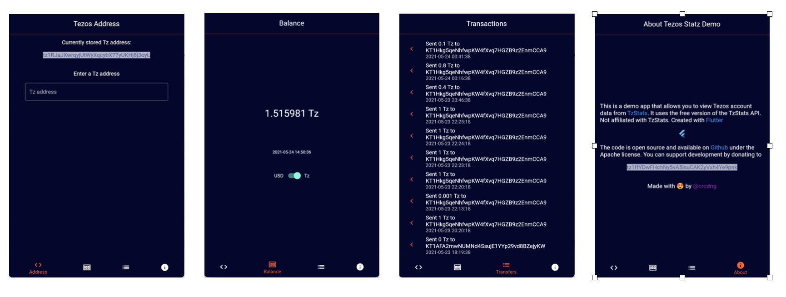

# Tezos Statz Demo



A small WIP demonstration app written in [Flutter](https://flutter.dev/) that allows to view [Tezos](https://tezos.com/) blockchain data.
On Android / iOS it includes a QR code scanner to scan the Tezos address. The web version doesn't have this feature.

Tezos Statz Demo calls the TzStats REST API provided by https://blockwatch.cc/

The API is documented here: https://tzstats.com/docs/api

The code is published under the Apache license. Not affiliated with TzStats. 

## How to run

Get Flutter:
https://flutter.dev/docs/get-started/install

Run in the browser:
`flutter run -d chrome`

Run on a mobile device:
```
flutter create .
flutter run -d <your Android device>
flutter run -d <your iOS device>
```

## Support development

You can support development and creative digital artwork curation by donating to crcrtn.tez / 
tz1ffYDwFHchNy5vA5isuCAK2yVxh4Ye9pnk 

## 3rd party contributions

See `pubspec.yaml` for Flutter package authors    
Blip sound by: http://jazzy.junggle.net/ (CC BY 3.0)    

## Progress

- create a minimal implementation, model-free (just functions) 🤯
- pull to refresh
- tap to copy donation address  
- balance: show balance in Tz and USD
- make workable Web version (without QRcode scanner)
- store address in Shared Preferences
- animate screen change
- address: show current address
- balance: fix refresh bug
- fixed parse URL scan
- animate USD / Tz switch
- fixed transaction type filter
- address: UI flow Text entry
- address: UI flow QR scan
- address: QR scan sound

## TODO

- fix The following LateError was thrown while finalizing the widget tree:
LateInitializationError: Field '_qrViewController' has not been initialized.
  
- improve the color scheme
- improve error handling 
- add .tez domain feature 
- load more transactions when paginate limit (100) is reached while scrolling down
- add statistics (view) 
- add detail view for transactions
- implement an address book with known addresses 
