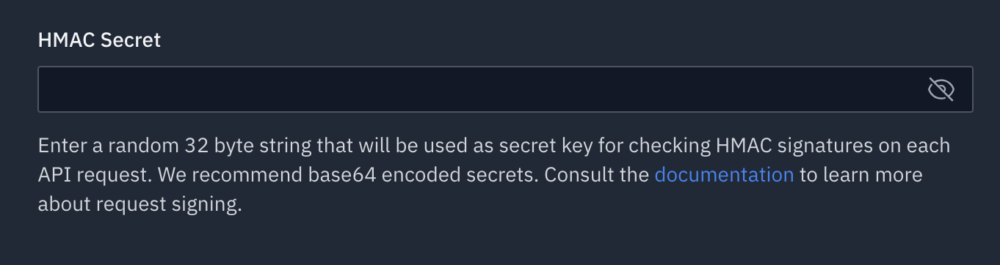

# Tezos Statz Demo


A demonstration app written in [Flutter](https://flutter.dev/) that allows to view [Tezos](https://tezos.com/) blockchain data (balance and list of transactions). On Android and iOS it includes a QR code scanner to scan the Tezos address. 

Tezos Statz Demo calls the TzPro REST API (formerly TzStats) provided by Blockwatch https://blockwatch.cc/.

The TzPro API is documented here: https://docs.tzpro.io/. It requires an API key from Blockwatch that you can get for free here: https://tzpro.io/. When you generate the key, klick the "Edit" button and look for a field called "HMAC Secret". Delete the contents of that field and click "Save".



Then 

## How to run

This repository contains only the source code. You have to build the app yourself. Get Flutter here https://flutter.dev/docs/get-started/install. Clone this repository and run `flutter create .` or add the target platforms (e.g. Web, iOS, Android, Mac) in your code editor. 

The API key is provided via an environment variable. Run your app with:

```
flutter run --dart-define TZPRO_KEY=<YOUR_API_KEY>
```

More info about handling API keys in Flutter, obfuscation and other issues: https://codewithandrea.com/articles/flutter-api-keys-dart-define-env-files/ as well as https://docs.tzpro.io/intro/access for securing API keys in general. Make sure you understand the implications of API key management, especially if you are not on the free API tier.

If you deploy to macOS, you need to edit both `macos/Runner/DebugProfile.entitlements` and ` macos/Runner/Release.entitlements` and add the following key:

```
<key>com.apple.security.network.client</key>
<true/>
```

If you deploy to Android, you need to edit `AndroidManifest.xml` as shown:

```
<manifest xmlns:android...>
 ...
 <uses-permission android:name="android.permission.INTERNET" />
 <application ...
</manifest>
```

If you deploy to iOS, you need to edit `iOS/Runner/Info.plist` and add the following key for the QR Code scanner to work:

```
<key>NSCameraUsageDescription</key>
<string>This app uses the camera to scan QR codes of Tezos addresses.</string>
```

## Support development

You can support development and creative digital artwork curation by donating to crcrtn.tez / 
tz1ffYDwFHchNy5vA5isuCAK2yVxh4Ye9pnk 

## 3rd party contributions

Blip sound by: http://jazzy.junggle.net/ (CC BY 3.0)    

## STATUS

**Working** the app is working again with the new TzPro API

## TODO

- overhaul architecture
- better error handling
- add tests

- improve / expand the color theme
- add .tez domain support 
- load more transactions when paginate limit (100) is reached while scrolling down
- add statistics (view) 
- add detail view for transactions

## DONE

Version 1.0

- create a minimal implementation, model-free (just functions) 🤯
- pull to refresh
- tap to copy donation address  
- balance: show balance in Tz and USD
- make workable Web version (without QR Code scanner)
- store address in Shared Preferences
- animate screen change
- address: show current address
- balance: fix refresh bug
- fixed parse URL scan
- animate USD / Tz switch
- fixed transaction type filter
- address: UI flow Text entry
- address: UI flow QR Code scan
- address: QR scan sound
- fix late initialization and setState after dispose

Version 1.1

- update Flutter and dependencies
- replace deprecated TzStats API with TzPro API


This code is published under the Apache license. It is not affiliated with Blockwatch or Tezos. 
